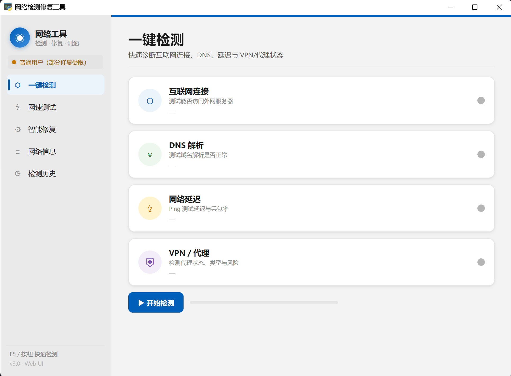

# 网络检测修复工具

一款 Windows 11 Fluent Design 风格的网络诊断、修复与测速工具，使用 Python + tkinter 编写，无需安装任何第三方依赖。



---

## 功能特性

### 🔍 一键检测
快速诊断网络连接状态，包含四项检测：

| 检测项 | 说明 |
|--------|------|
| **互联网连接** | 测试能否访问外网服务器（多目标 TCP 连接探测） |
| **DNS 解析** | 测试域名解析是否正常，并测量解析耗时 |
| **网络延迟** | Ping 测试延迟与丢包率；ICMP 被屏蔽时自动回退到 TCP 连接延迟测量 |
| **VPN / 代理** | 检测代理状态、VPN 类型与安全风险（信息型，不计入异常统计） |

- 检测失败的项目会在卡片内**直接显示修复建议按钮**，一键执行对应修复
- 检测结果**自动保存到本地历史记录**

### ⚡ 网速测试
- 从多个国内镜像源（腾讯 CDN、清华/中科大镜像等）实测下载速度
- **半圆弧仪表盘实时显示**下载速度，颜色随速度变化
- 展示平均速度、峰值速度、下载量、耗时、最优测速源与网络评级
- 各测速源独立进度条，可随时停止
- **自动绕过系统代理**直连，避免 VPN 关闭后代理残留导致测速失败

### ⚙️ 智能修复
一键修复常见网络问题：

| 修复项 | 作用 | 注意事项 |
|--------|------|----------|
| 刷新 DNS 缓存 | 清除本地 DNS 缓存 | 安全操作，不影响正常使用 |
| 清除代理设置 | 关闭系统代理 | 会关闭当前代理 |
| 重置 Winsock | 重置网络协议栈 | 需重启计算机生效，需管理员 |
| 释放并更新 IP | 重新获取 IP 地址 | 操作期间短暂断网，需管理员 |
| 重置网络适配器 | 恢复默认配置 | 需重启计算机生效，需管理员 |

> 程序会自动检测管理员权限，非管理员模式下会提示哪些操作可能失败。

### ≡ 网络信息
查看当前设备网络配置：主机名、IPv4 地址、默认网关、MAC 地址、DNS 服务器，每项均可一键复制。

### ◷ 检测历史
按时间倒序展示最近 50 条检测记录，**持久保存于本地**，重启程序不丢失。支持一键**清空历史**（二次点击确认，防误删）。

---

## VPN / 代理检测说明

本工具采用三层检测机制识别 VPN/代理：

1. **系统代理检测** —— 读取注册表代理设置，识别 Clash / V2Ray / Shadowsocks 等代理型工具
2. **网络适配器扫描** —— 扫描虚拟网卡，识别 WireGuard、OpenVPN、Cisco AnyConnect、Tailscale 等
3. **Cloudflare WARP 专项检测** —— 通过 Cloudflare 官方 `cdn-cgi/trace` 端点检测 WARP（WARP 不设系统代理、适配器名特殊，常规手段无法识别）

**可识别的 VPN 类型：**
- 代理型（Clash / V2Ray / SS 类）
- 虚拟网卡型（WireGuard / OpenVPN / Cloudflare WARP 类）
- 企业 VPN（Cisco AnyConnect / FortiClient / GlobalProtect 等）
- 异地组网（Tailscale / ZeroTier / Hamachi）
- 系统拨号 VPN（PPTP / L2TP / IKEv2）

**风险评估**（无 / 较低 / 中等 / 较高）依据：
- 是否通过本地代理转发明文流量
- 是否存在 DNS 泄漏风险
- 出口 IP 是否被改变（直连与代理出口 IP 对比）
- 是否存在多重 VPN/代理叠加

---

## 运行方式

### 环境要求
- Windows 系统（部分功能兼容 Linux / macOS）
- Python 3.x

### 启动
界面基于 PyWebview（HTML/CSS/JS 渲染的 Fluent Design），是独立桌面程序，无需浏览器。

首次运行需安装依赖：

```bash
pip install -r requirements.txt
```

然后双击 `启动网络工具.bat`，或运行：

```bash
python app.py
```

### 快捷键
- **F5** —— 快速刷新当前页面（重新检测 / 重新测速 / 刷新信息）

---

## 项目结构

```
app.py               程序入口（PyWebview 桥接后端）
web/                 前端界面
  ├─ index.html      页面结构
  ├─ styles.css      Fluent Design 样式
  └─ app.js          前端逻辑（含实时测速推送）
network_utils.py     网络检测与修复功能（连通性、DNS、Ping、修复操作）
speed_tester.py      网络测速模块（多源测速，绕过代理直连）
vpn_detector.py      VPN / 代理检测模块（含风险评估）
history.py           检测历史持久化模块
requirements.txt     第三方依赖清单
启动网络工具.bat       启动脚本
```

---

## 常见问题

**Q：网络正常，但延迟检测显示丢包 100%？**
A：很多路由器、运营商或目标主机会屏蔽 ICMP 包，导致 Ping 拿不到回包。本工具已在 ICMP 失败时自动回退到 TCP 连接延迟测量，正常情况下不会再误报。

**Q：开着 VPN 时测速失败 / 国内镜像连不上？**
A：这是正常现象——VPN 把流量路由到了境外节点。建议关闭 VPN 后再测速。

**Q：关闭 VPN 后测速仍然全部失败？**
A：可能是 VPN 关闭后系统代理设置残留。可在「智能修复」中执行「清除代理设置」。本工具的测速模块已默认绕过系统代理直连。

**Q：使用 Cloudflare WARP 时为什么提示中等风险？**
A：WARP 会接管全局流量经 Cloudflare 隧道转发。Cloudflare 为可信厂商，但仍可见你的访问元数据与 DNS，故标记为中等风险，仅供参考。
